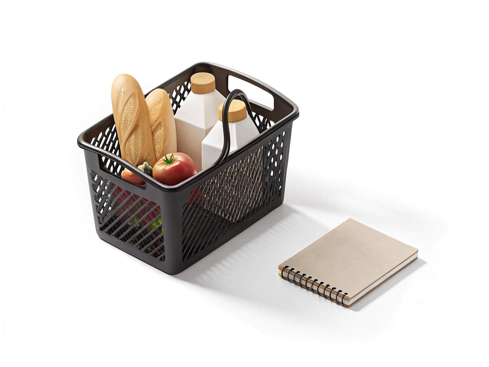

title: "Расход"

section: "6.1 Самостоятельная жизнь и бытовые навыки"
topic: "Как разумно тратить деньги"
age: 10
---

# Расход

**Расход** - это деньги, которые ты тратишь.

## Какие бывают расходы
- Обязательные: проезд, школьные мелочи.
- Полезные: книга, тетради, спортивный инвентарь.
- Развлекательные: игрушка, сладости, игры.

## Как контролировать расходы
- Записывай траты в заметку.
- Сохраняй [чеки](./receipt.md).
- Сравнивай [цену](./price.md) и [качество](./quality.md) перед покупкой.

## Пример из школьной жизни
Во вторник ты купил сладости и наклейки, а в пятницу оказалось, что нужны деньги на рабочую тетрадь. В этот момент хорошо видно, почему учет расходов правда помогает.

## Связанные понятия
[Бюджет](./budget.md), [чек](./receipt.md), [цена](./price.md), [сравнение](./comparison.md), [импульсивная покупка](./impulse_purchase.md).

---
Авторы: Алимов Ирфан Рифатович, Шмотова Александра Игоревна, Венгер Ирина Витальевна, Моисеев Кирилл Всеволодович, Тараскаев Давид Михайлович;  
GitHub ответственный: @kloshka;
*Ресурсы: GigaChat/YandexGPT, ручная редактура и проверка команды 6.1*

